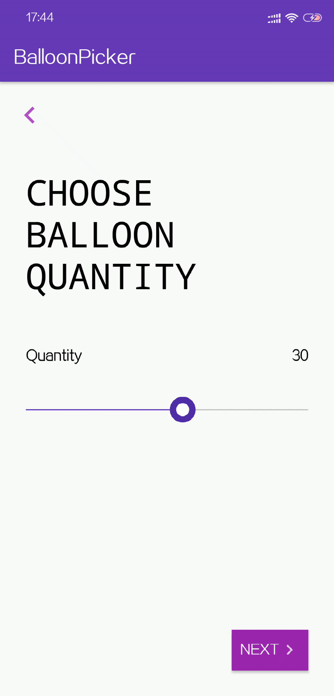

# BalloonPicker


A slimy Android balloon seek bar library in Kotlin, 

<p align="center">
    
    <p align="center">
		<em>preview</em>
	</p>
</p> 
 

## 开始使用
修饰一下，抛出必要的样式设置方法，最终效果完成：
//使用方法

Add it in your root build.gradle at the end of repositories:

	allprojects {
		repositories {
			...
			maven { url 'https://jitpack.io' }
		}
	}
Step 2. Add the dependency

	dependencies {
	        implementation 'com.github.fairytale110:BalloonPicker:1.0.1'
	}


Then, Drop it to XML layout or new it

```xml
<tech.nicesky.balloonpicker.BalloonPickerView
        android:id="@+id/balloon_picker"
        android:layout_width="match_parent"
        android:layout_height="wrap_content"
 />
```

Finally, custom it's style as you want


```kotlin


fun load(){
     balloon_picker.layerValues(10, 50, 5)
     
     balloon_picker.defaultValue(30)
     balloon_picker.setColorFoThumb("#FFFFFF".toColorInt(), "#512DA8".toColorInt())
     balloon_picker.setColorForLayer("#512DA8".toColorInt(), "#BDBDBD".toColorInt())
     balloon_picker.setColorForBalloon("#512DA8".toColorInt())
     balloon_picker.setColorForBalloonValue("#FFFFFF".toColorInt())
     balloon_picker.colorOfDesc = "#000000".toColorInt()
     balloon_picker.colorOfValue = "#000000".toColorInt()
     balloon_picker.desc = "Quantity"
     balloon_picker.valueListener = object : BalloonPickerListener{
               override fun changed(value: Long) {
                      Log.w("MainActivity","value: $value")
               }
     }
     // val valueSelected = balloon_picker.getValue()
 }
```

> 当然，这个控件还有很大的优化空间，欢迎诸位一起探讨。

## THANKS

All design and inspiration credits belongs to 
[Cuberto](https://dribbble.com/shots/6549207-Balloon-Slider-Control)
