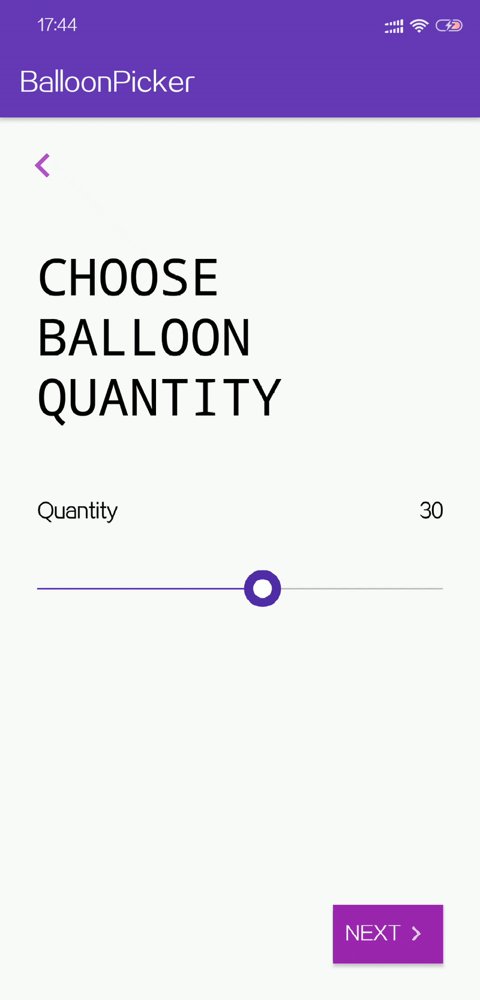

<p align="center">
    
    <p align="center">
		<em>preview</em>
	</p>
</p> 
 


## 控件拆分：

元素 | 拆分 |  效果  
-|-|-
基线 | 已选择、未选择 | 根据触摸块改变长度 |
触摸块 | 触摸动画、内外圆 | 触摸时，内外圆按各自约束匀速放大；结束时，内外圆按各自约束匀速缩小 |
气球 | 缩放、位移 | 触摸前后缩放，移动时，匀速移动，中心旋转 |
文本 | 描述、值回调 | 普通文本、触摸显示回调值 |


## 绘制流程拆分

### 绘制基线和触摸块

    分别绘制选中和未选中的基线
    然后绘制触摸块外圆和内圆 

<p align="center">
    
    <p align="center">
		<em>绘制基线和触摸块</em>
	</p>
</p> 

### 为触摸块添加动画
####   触摸块样式动画
 以外圆圆心为中心，达到半径100像素范围内的触摸点，均可触发内圆缩放动画。

 1、默认触摸状态下，动画以默认半径开始匀速递增，同时刷新视图，直到最大内圆半径为止。 

 2、放大过程中，如果用户手指离开屏幕，触发MOVE_UP事件，则停止已有放大动画，转而执行缩小内圆半径的动画，直到达到最小内圆半径为止。

 3、如果缩小过程中用户再次触摸此区域，则重复执行过程1，以此达到跟随交互效果。

 同理，外圆的缩放规则遵循上述规则

 为了让动画效果更加平顺，并且不浪费太多时间在缩放过程中，我们将在缩放开始前结束已在执行中的动画，并重新计算剩余缩放过程需要的时间差，用于当前缩放过程。

 缩放动画时间差计算公式：

 >实际动画持续时间 = 动画持续时间 * 剩余缩(放)距离/总缩(放)距离

 ```kotlin 

val remainingTime: Long = when {
                this.increase -> (duration* (thumbInnerCircleRadiusMax - thumbInnerCircleRadiusTemp)/(thumbInnerCircleRadiusMax - thumbInnerCircleRadiusDefault)).toLong()
                else -> (duration* (thumbInnerCircleRadiusTemp - thumbInnerCircleRadiusDefault)/(thumbInnerCircleRadiusMax - thumbInnerCircleRadiusDefault)).toLong()
} 
        
 ```
 <p align="center">
    
    <p align="center">
		<em>触摸效果</em>
	</p>
</p> 

####    触摸块位移

当触发MOVE_MOVE时，根据触摸坐标x差值，更新触摸块的x坐标。同时，计算出此时选择器的value，更新两侧基线状态，并执行回调。

```kotlin
val x = pointOfThumbTemp.x + event.x - pointOfTouchDown.x

pointOfThumb = PointF( if (x > xOfTrackLayerEnd) xOfTrackLayerEnd  else ( if (x < xOfTrackLayerStart) xOfTrackLayerStart else x), pointOfThumbTemp.y)

selectedValue = (this.minValue.toFloat() + (this.maxValue.toFloat() - this.minValue.toFloat()) * (pointOfThumb.x - xOfTrackLayerStart) / (widthOfView - 2 * xOfTrackLayerStart)).toLong()

postInvalidate()

listener?.callBack(selectedValue)
```

<p align="center">
    
    <p align="center">
		<em>触摸效果</em>
	</p>
</p> 

### 气球动画

通过拆分：
1、ACTION_MOVE，当触摸坐标发生位移，气球旋转对应角度以保持风力阻挡的惯性。气球中心点到基线的垂线，与气球中心点和触点中心点 的直线的夹角，即为当前状态下的旋转角度
//分析图

```kotlin
 override fun locationOfThumb(pointF: PointF) {
        pointThumb.set(pointF.x, height.toFloat() - trackLayer?.getPadding()!!)
        val b = pointF.x - trackLayer?.getPadding()!!
        val angleRoTan = -atan(b/distanceVerticalBetweenBalloonAndTrackLayer) / PI  * 180
        L("angleRoTan $angleRoTan")
        balloon?.rotation = if (angleRoTan.toFloat() > 0F ) 0F else angleRoTan.toFloat()
        postInvalidate()
 }

```

<p align="center">
    
    <p align="center">
		<em>旋转气球（假装蓝色块是气球）</em>
	</p>
</p> 


此时气球能跟着“线”被“手”带”动“了，但是气球还没有移动，“线”也没有无限长，行，我们先让气球移动起来。

这里需要设定一个阀值，即“线”的长度，当超过这个阀值，则气球将被“拽着”移动。
```kotlin
 private fun moveBalloon(){
    val ptb2 = (pointThumb.x - centerOfBalloon.x).toDouble().pow(2.0)
    val c =  sqrt (ptb2 + centerOfBalloon.y * centerOfBalloon.y)
    ...
 }
```
直接计算“线”长来判断，但是这样需要繁琐的符号运算，这里我们可以直接找个参考数据，简化逻辑过程：
```kotlin
 private fun moveBalloon(){
    val b = pointThumb.x - centerOfBalloon.x
    ...
 }
```
通过触点与气球中心点的垂直距离的变化来判断是否需要进行“拽着”移动：
```kotlin
    override fun locationOfThumb(pointF: PointF) {
        pointThumb.set(pointF.x, height.toFloat() - trackLayer?.getPadding()!!)
        moveBalloon()
    }

    private fun moveBalloon(){
        val b = pointThumb.x - centerOfBalloon.x
        val ins = abs(b) - (height - pointThumb.y)
        if (b != 0F && ins > 0){
            
            val xOfBalloon = centerOfBalloon.x.toInt() - balloon?.layoutParams!!.width / 2 + if (b > 0)  ins.toInt() else - ins.toInt()
            
            balloon?.layout( xOfBalloon, balloon?.y!!.toInt(), xOfBalloon + balloon?.layoutParams!!.width, measuredHeight - trackLayer?.layoutParams!!.height)
            
            centerOfBalloon.set(balloon?.x!! + balloon?.layoutParams!!.width / 2F,  balloon?.y!! + balloon?.layoutParams!!.height / 2)
        
        } else {
            //TODO moveBalloonWithAnim
        }

        val angleRoTan = -atan(b/distanceVerticalBetweenBalloonAndTrackLayer) / PI  * 180
        L("angleRoTan $angleRoTan")
        balloon?.rotation = angleRoTan.toFloat()
        postInvalidate()
    }
```

<p align="center">
    
    <p align="center">
		<em>拖拽气球</em>
	</p>
</p> 

此时气球已经可以被拽着走了，为了让效果更加逼真，在阀值内，我们通过动画来缓慢移动，  

2、同时以匀速向新的圆点移动，直到气球中心x与触摸点x重合。
通过监听将TrackLayer的touch数据传递给pickerView，改造了统一的接口:
```Kotlin
interface TrackLayerListener {
   fun layerTouchedDown()
   fun layerTouchedUp()
   fun layerTouchedMoving(value : Long, pointAtLayer : PointF)
}
```
在 layerTouchedMoving() 中处理气球的移动逻辑.

当球心与圆点距离小于阀值时，中断气球动画，直接布局气球在picker中的位置；否则，执行新的气球动画:
```Kotlin
 override fun layerTouchedMoving(value: Long, pointAtLayer: PointF) {
        pointThumb.set(pointAtLayer.x, height.toFloat() - trackLayer?.getPadding()!!)
        val b = pointThumb.x.toInt() - centerOfBalloon.x.toInt()
        if (abs(b) > distanceVerticalBetweenBalloonAndTrackLayer.toInt()){
            initAnimation(ValueAnimator.ofInt(centerOfBalloon.x.toInt(), pointThumb.x.toInt()))

            val xOfBalloon = (centerOfBalloon.x - balloon?.layoutParams!!.width / 2 + if (b > 0)  b-distanceVerticalBetweenBalloonAndTrackLayer else b + distanceVerticalBetweenBalloonAndTrackLayer).toInt()
            
            balloon?.layout( xOfBalloon , balloon?.y!!.toInt(), xOfBalloon + balloon?.layoutParams!!.width, balloon?.y!!.toInt() +balloon?.layoutParams!!.height )
            
            centerOfBalloon.set(xOfBalloon + balloon?.layoutParams!!.width / 2F,  balloon?.y!! + balloon?.layoutParams!!.height / 2)

            rotateBalloon()
        }
        moveBalloon()
    }
```
<p align="center">
    
    <p align="center">
		<em>拖拽气球</em>
	</p>
</p> 

效果还可以，接下来就需要根据picker的取值来动态缩放气球，同时维持住气球的底部位置不变
本计划直接调用scale API， 奈何privot也需要动态控制，不然不能维持气球底部垂直位置不变。

```Kotlin
 override fun layerTouchedMoving(value: Long, pointAtLayer: PointF) {
            //...
            val valueAtBalloon =trackLayer?.minValue()!! +  (trackLayer?.maxValue()!! - trackLayer?.minValue()!!) *  centerOfBalloon.x/measuredWidth
            
            val disScaleHeight = balloonHeightDefault * (valueAtBalloon - trackLayer?.minValue()!!) / (trackLayer?.maxValue()!! - trackLayer?.minValue()!!)
            
            val disScaleWidth = balloonWidthDefault/2 * (valueAtBalloon - trackLayer?.minValue()!!) / (trackLayer?.maxValue()!! - trackLayer?.minValue()!!)
            
            //...
            balloon?.layout( xOfBalloon  , balloonDefaultY.toInt() - disScaleHeight.toInt(), xOfBalloon + balloonWidthDefault.toInt() + disScaleWidth.toInt() * 2, (balloonDefaultY + balloonHeightDefault).toInt())
            centerOfBalloon.set(xOfBalloon + disScaleWidth + balloonWidthDefault / 2F,  balloonDefaultY + balloonHeightDefault/2 - disScaleHeight/2 )
            //...
        }
        //...
 }
```
 给气球打上辅助线，我们来看下效果：
 <p align="center">
     
     <p align="center">
 		<em>拖拽气球</em>
 	</p>
 </p> 

4、气球显示隐藏
气球能动能缩放了，接下来给气球加入出入动画，

默认情况下，不展示气球，当ACTION_DOWN 触发，气球冲圆点渐显 & 放大 & 移动 到初始位置；

当ACTION_UP 触发，气球从当前位置 淡出 & 缩小 & 移动 到圆点位置

```kotlin

override fun layerTouchedDown() {
        balloon?.startAnimation(BalloonAnimSet.create(true, 0F, 0F, pointThumb.y - balloon?.y!!, 0F, context , listenerEnter))
}

override fun layerTouchedUp() {
        balloon?.visibility = View.INVISIBLE
        pointThumb.set(trackLayer?.centerPoint()!!.x, height.toFloat() - trackLayer?.getPadding()!!)

        initAnimation(ValueAnimator.ofInt(centerOfBalloon.x.toInt(), pointThumb.x.toInt()))

        moveBalloon()
        balloon?.startAnimation(BalloonAnimSet.create(false, 0F, 0F, 0F, pointThumb.y - balloon?.y!!, context , listenerExit))
}
 
```
来看看效果吧:
 <p align="center">
     
     <p align="center">
 		<em>拖拽气球</em>
 	</p>
 </p> 

## 开始使用
修饰一下，抛出必要的样式设置方法，最终效果完成：
//使用方法
```xml
<tech.nicesky.balloonpicker.BalloonPickerView
        android:id="@+id/balloon_picker"
        android:layout_width="match_parent"
        android:layout_height="wrap_content"
 />
```

```kotlin

fun load(){
     balloon_picker.layerValues(10, 50, 5)
     
     balloon_picker.defaultValue(30)
     balloon_picker.setColorFoThumb("#FFFFFF".toColorInt(), "#512DA8".toColorInt())
     balloon_picker.setColorForLayer("#512DA8".toColorInt(), "#BDBDBD".toColorInt())
     balloon_picker.setColorForBalloon("#512DA8".toColorInt())
     balloon_picker.setColorForBalloonValue("#FFFFFF".toColorInt())
     balloon_picker.colorOfDesc = "#000000".toColorInt()
     balloon_picker.colorOfValue = "#000000".toColorInt()
     balloon_picker.desc = "Quantity"
     balloon_picker.valueListener = object : BalloonPickerListener{
               override fun changed(value: Long) {
                      Log.w("MainActivity","value: $value")
               }
     }
     // val valueSelected = balloon_picker.getValue()
 }
```

> 当然，这个控件还有很大的优化空间，欢迎诸位一起探讨。
> GitHub：https://github.com/fairytale110